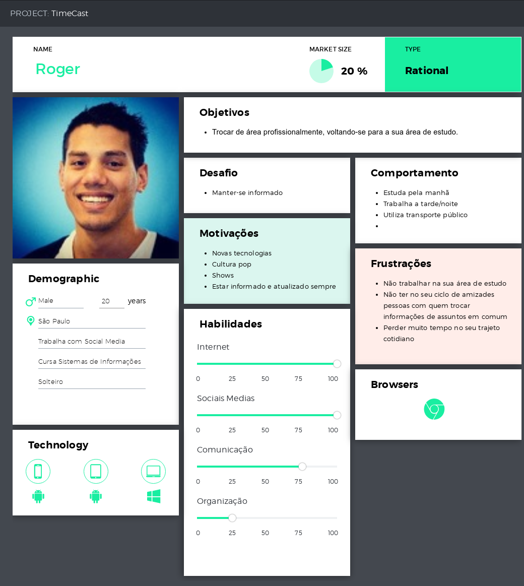
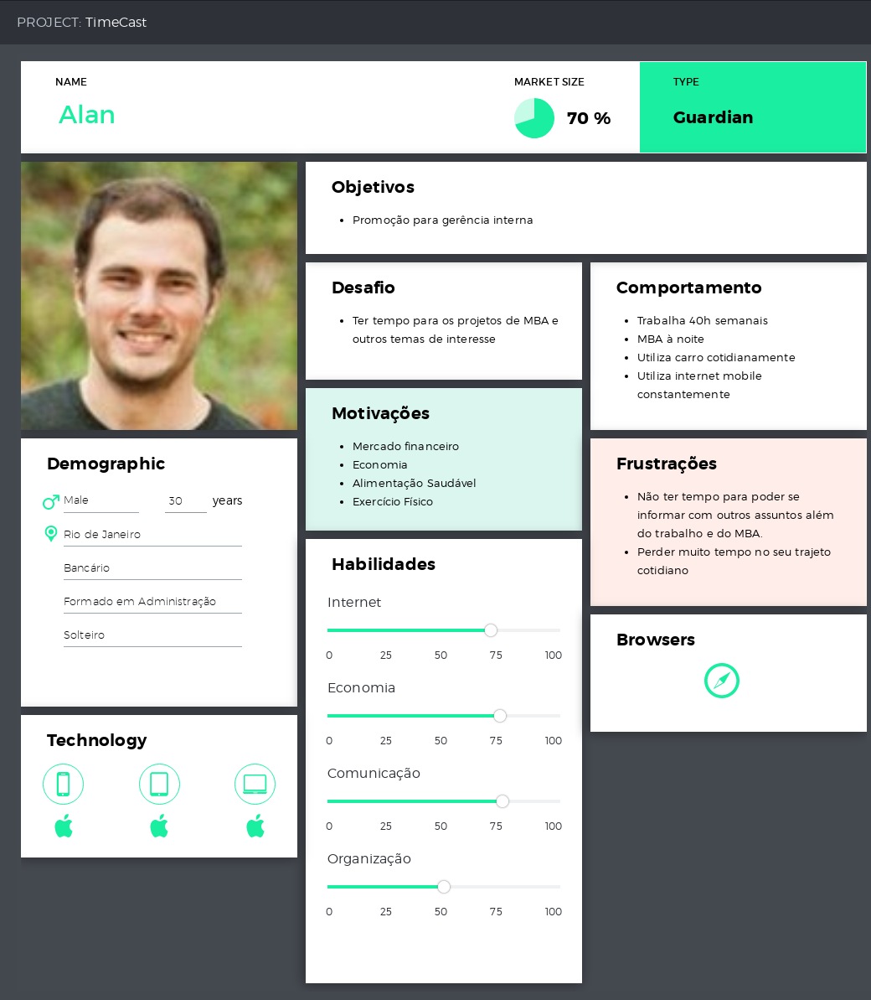
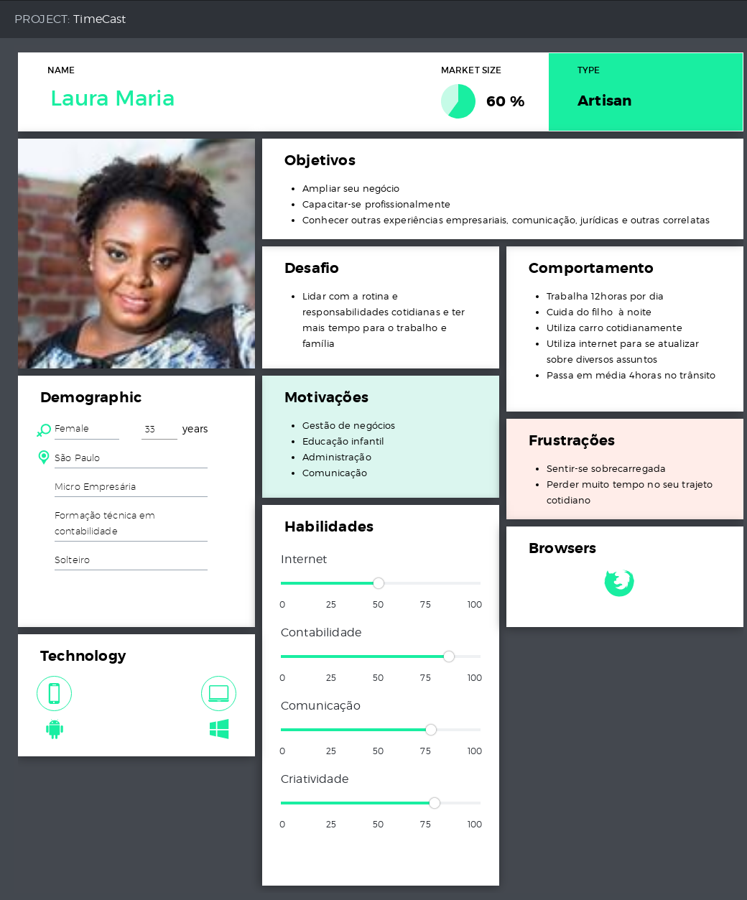

# TimeCast

Projeto TimeCast <Laboratoria>

[Link - TimeCast](https://timecast-1557870834786.firebaseapp.com/)

## Índice

* [Definição do produto](#definição-do-produto)
* [Personas](#personas)
* [Histórias de usuário](#Histórias-de-usuário)
* [Protótipo](#protótipo)
* [Pesquisa com usuários](#Pesquisa-com-usuários)
  * [Testes de usabilidade](#testes-de-usabilidade)
  * [Definição de pronto](#Definição-de-pronto)
  * [Principais tecnologias Utilizadas](principais-tecnologias-utilizadas)
* [Roadmap](#roadmap)

## Organização/Planejamento

A organização do projeto foi feita através do [Trello](https://trello.com/b/XNYU5Kpe/projeto-timecast).
Determinamos as necessidades básicas para a completude do projeto inicialmente, depois especificamos de uma forma mais detalhada cada funcionalidade dividindo-as pelo grupo. O trabalho coletivo desmonstrou-se essencial à conclusão do projeto, bem como as horas de hacking em conjunto.

## Definição do produto
O TimeCast é uma aplicação voltada para otimização do tempo de quem escuta podcasts ou quiser escutá-los baseado no tempo determinado pelo usuário, seja ele pelo percuso escolhido ou pelo tempo inputado.

Através de pesquisa feita na internet na definição do produto, consultamos a pesquisa feita pela Associação Brasileira de Podcasters e retiramos dados para elaboração do mesmo e do perfis dos usuários. Abaixo segue os links do site e da pesquisa realizada em 2018:
 * [Site ABPOD - Associação Brasileira de Podcasters](http://abpod.com.br/)
 * [Pesquisa - 2018](http://www.abpod.com.br/media/docs/PodPesquisa-2018.pdf)

## Personas

**Roger**

**Alan**

**Ana Maria**

## Histórias de usuário

DECLARAÇÕES DE PROBLEMAS

**[Persona]** precisa de **[necessidade]**, porque/para **[insight]**

Roger, estudante, precisa de informações da área de TI para mudar de área.
Roger, estudante, precisa de aplicativos/serviços web gratuitos pq não tem dinheiro.
Roger, precisa se conectar com pessoas de interesse em comum para compartilhar suas preferencias.

Alan, bancário, precisa estar informado sobre o mundo financeiro para concluir mba e poder participar processos seletivos.
Alan, precisa otimizar seu tempo enquanto se exercita para manter-se atualizado. 

Laura, empresária, precisa utilizar do seu tempo de locomoção para manter-se atualizada
Laura, precisa de indicações de conteúdo em áudio para otimizar sua rotina.

## Protótipo

O protótipo da TimeCast, pode ser visualizado no link abaixo:

[Protótipo da aplicação](https://marvelapp.com/5i396b0/screen/56939943)

## Pesquisa com usuários
  A pesquisa foi feita com 30 usuários(as) e os dados foram coletados através de [Formulário de pesquisa](https://forms.gle/LEg8wnfvzsFXZmMy8).

  Com base nas respostas obtidas, pudemos constatar que:
  * 80% dos entrevistados(as) ouvem podcasts;
  * 46,7% dos entrevistados(as) tem idade entre 18-29 anos e 46,7% entre 30-39 anos;
  * 73,3% dos entrevistados(as) foram do gênero feminino;
  * A maioria utiliza metrô, carro, se locomove como pedestre e ônibus, respectivamente;
  * 46,7% dos entrevistados passam entre 30 min e 1 hora em cada trajeto, seguido de 23,3% que passam entre 1 h e 1:30;
  * 83,3% dos entrevistados gostarariam/usariam um site que indicasse podcasts para você se informar sobre assuntos do seu interesse baseado no seu tempo de trajeto.

  
### Testes de usabilidade
  Os feedbacks e comentários recebidos dos testes com protótipo foram positivos para a execução do aplicação;
  Nosso protótipo foi de alta fidelidade em mobile-first.

### Definição de pronto

* A aplicação atende a todos os requisitos para que o usuário complete a operação desejada.
* O código segue o guia de estilos estipulado.
* Usuários testaram a aplicação desde sua prototipagem até a conclusão.
* Melhorias identificadas nos testes foram implementadas.
* A aplicação passou nos testes.
* O código está sincronizado com as atualizações finais no repositório remoto.

### Principais tecnologias Utilizadas
* JavaScript
* JQuery
* Firebase
* Bootstrap
* API Deezer
* API Here

A implementação do projeto foi feita de maneira dinâmica entre as tecnologias usadas, de acordo com os requisitos pedidos, seguindo da tela inicial com escolha para login ou cadastro, Boas vindas (para cadastro), home: trajeto ou tempo/sugestão de podcast, pesquisar, sair, sendo a tela home com os pontos principais da aplicação funcional: escolha pelo trajeto ou tempo, sugestões de podcasts baseado no tempo, seja tempo de trajeto ou tempo escolhido e play do podcast escolhido pelo usuário. O ícone de pesquisa e outras funcionalidade do roadmap apresentam ideias para serem implementadas futuramente.

## Roadmap
### Versão 1.0.0

* Uso de duas APIs (Deezer e Here);
* Autenticação pelo Firebase;
* Banco de Dados Firebase;
* Eslint;
* Storage.

### Versão 2.0.0

* Configurações de perfil;
* Pesquisa de podcasts;
* Seguir podcasts;
* Avaliação dos podcasts ouvidos;

### Versão 3.0.0

* Tradução do Read-me para inglês;
* Compartilhamento nas redes sociais;
